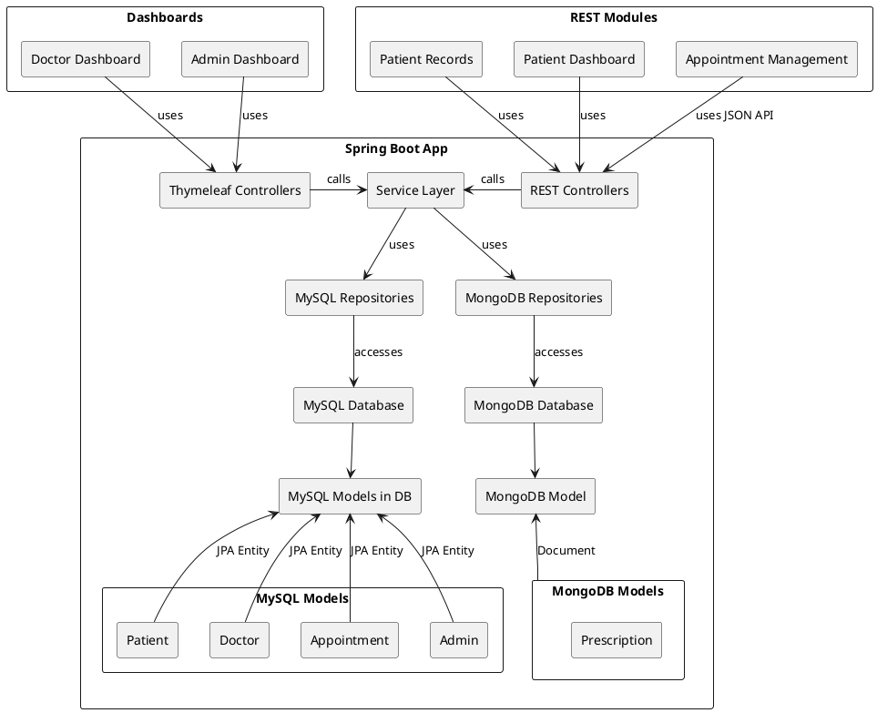

Einführung
==========

Die SmartClinic App stellt ein intelligentes Klinik-Management-System dar, was die Ärzte, die Patienten als auch die Klinikverwaltung bei ihren Aufgaben unterstützen soll.
Diese Anwendung soll ein robustes, sicheres und skalierbares System darstellen, welches den Stakeholdern einen entsprechenden Mehrwert bei Ihrem Aufenthalt bzw. ihrer Arbeit in der Klinik zur verfügung stellt.

Geschäftskontext
----------------

G1: Ärzte möchten die Daten zu den Patienten verwalten: bisherige Daten der Patienten ansehen und ggf. ergänzen, Anamnesen eintragen, ergänzen und ggf. korrigieren, bisherige Rezepte ansehen, neu zu verordnende Rezepte erstellen und dem Patienten bereitstellen, Zeiträume für Nachfolge-Termine vorschlagen
G2: Patienten möchten ihre Daten ggf. prüfen können, neue Termine absprechen / eintragen lassen, Termine abrufen, ggf. Rezepte erhalten (als Ausdruck oder in elektronischer Form)
G3: Verwalter möchten Daten zu den Patienten eintragen: Patienten mit ihren Basis-Daten neu anlegen, Termine in Absprache mit Ärzten und Patienten eintragen, ggf. Rezepte dem Patienten bereitstellen

Stakeholder
-----------

coursera (Prüfung der Kenntnisse für IBM Java Developer)
Entwickler (Vertiefung und Festigung des Wissens)
Endnutzer (Ärzte, Patienten, Verwaltung/Admin)

Ziele dieses Dokuments
----------------------

Das Dokument soll einen Überblick über das Software-Projekt geben und Interessierten den Einstieg in die Details ermöglichen.

System Kontext und Einsatzbereich
=================================

System Abgrenzung
-----------------

Domain Modell
-------------

Anforderungen
=============

Funktionale Anforderungen
-------------------------

Qualitätsattribute
------------------

System-Details
==============

System-Struktur
---------------

Präsentationslayer - Das Benutzerinterface nutzt Thymeleaf Templates und REST API Clients
Anwendungslayer - Das Spring Boot Backend besteht aus Controllern, Services und Geschäftslogik.
Datenlayer - Die Datenbasis: eine MySQL Datenbank für strukturierte Daten und eine MongoDB für flexible, dokumentenbasierte Daten.

Diese Spring Boot-Anwendung verwendet sowohl MVC- als auch REST-Controller.
Thymeleaf-Vorlagen werden für die Admin- und Doctor-Dashboards verwendet,
während REST-APIs alle anderen Module  ( "Patient Record", "Patient Dashboard" and "Appointment Management" ) bedienen.
Die Anwendung interagiert mit zwei Datenbanken:
MySQL (für Patienten-, Arzt-, Termin- und Administrationsdaten) und MongoDB (für Rezepte).
Alle Controller leiten Anfragen über eine gemeinsame Service-Schicht weiter, die wiederum an die entsprechenden Repositories delegiert.
MySQL verwendet JPA-Entitäten, während MongoDB Dokumentmodelle verwendet.

Schichten-Modell
----------------

1. Benutzeroberflächen-Schicht
Das System unterstützt mehrere Benutzertypen und Interaktionsmuster. Benutzer können über folgende Wege auf die Anwendung zugreifen:
- Thymeleaf-basierte Web-Dashboards wie Admin-Dashboard und Doctor-Dashboard. Dies sind traditionelle HTML-Seiten, die auf dem Server gerendert und an den Browser ausgeliefert werden.
- REST-API-Clients wie mobile Apps oder Frontend-Module (z.B. Appointment Management, Patienten-Dashboard und Patienten-Record), die über HTTP mit dem Backend interagieren und JSON-Antworten erhalten.
Diese Trennung ermöglicht es dem System, sowohl interaktive Browseransichten als auch skalierbare API-basierte Integrationen zu unterstützen.

2. Controller-Schicht
Wenn ein Benutzer mit der Anwendung interagiert (z.B. durch Klicken auf einen Button oder Einreichen eines Formulars), wird die Anfrage basierend auf dem URL-Pfad und der HTTP-Methode an einen Backend-Controller weitergeleitet.
- Anfragen für servergerenderte Ansichten werden von Thymeleaf-Controllern bearbeitet, die .html-Vorlagen zurückgeben, die mit dynamischen Daten gefüllt und im Browser gerendert werden.
- Anfragen von API-Nutzern werden von REST-Controllern bearbeitet, die die Eingaben verarbeiten, Backend-Logik aufrufen und Antworten im JSON-Format zurückgeben.
Diese Controller dienen als Einstiegspunkte in die Backend-Anwendungslogik, validieren Anfragen und koordinieren den Anfrage-/Antwortfluss.

3. Serviceschicht
Alle Controller delegieren die Logik an die Serviceschicht, die das Herz des Backend-Systems darstellt.
Diese Service-Schicht:
- wendet Geschäftsregeln und Validierungen an
- koordiniert Arbeitsabläufe über mehrere Entitäten hinweg (z.B. Überprüfung der Verfügbarkeit von Ärzten vor der Terminvereinbarung)
- stellt eine saubere Trennung zwischen Controller-Logik und Datenzugriff sicher
Durch die Isolierung der Geschäftslogik wird die Anwendung wartungsfreundlicher, testbarer und leichter skalierbar.

4. Repository-Schicht
Die Diensteschicht kommuniziert mit der Repository-Schicht, um Datenzugriffsoperationen durchzuführen.
Diese Schicht umfasst zwei Arten von Repositories:
- MySQL-Repositories, die Spring Data JPA verwenden, um strukturierte relationale Daten wie Patienten, Ärzte, Termine und Verwaltungsunterlagen zu verwalten.
- MongoDB-Repository, das Spring Data MongoDB verwendet, um dokumentbasierte Datensätze wie Rezepte zu verwalten.
Repositories abstrahieren die Logik des Datenbankzugriffs und bieten eine einfache, deklarative Schnittstelle zum Abrufen und Speichern von Daten.

5. Datenbankzugriff
Jedes Repository kommuniziert direkt mit der zugrunde liegenden Datenbank-Engine:
- MySQL speichert alle Kern-Entitäten, die von einem normalisierten relationalen Schema und Einschränkungen profitieren - wie Benutzer, Rollen und Termine.
- MongoDB speichert flexible und geschachtelte Datenstrukturen, wie Rezepte, die im Format variieren können und eine schnelle Schema-Evolution ermöglichen.
Dieses Dual-Datenbank-Setup nutzt die Stärken sowohl strukturierter als auch unstrukturierter Datenspeicheransätze.

6. Modellbindung
Sobald Daten aus der Datenbank abgerufen werden, werden sie in Java-Modellklassen gemappt, mit denen die Anwendung arbeiten kann.
Dieser Prozess wird als Modellbindung bezeichnet.
- Im Fall von MySQL werden Daten in JPA-Entitäten umgewandelt, die Zeilen in relationalen Tabellen repräsentieren und mit @Entity annotiert sind.
- Für MongoDB werden Daten in Dokumentenobjekte geladen, die typischerweise mit @Document annotiert sind und auf BSON/JSON-Strukturen in Sammlungen abgebildet werden.
Diese Modellklassen bieten eine konsistente, objektorientierte Darstellung der Daten über die Anwendungsschichten hinweg.

7. Verwendete Anwendungsmodelle
Schließlich werden die gebundenen Modelle in der Antwortschicht verwendet:
- In MVC-Workflows werden Modelle vom Controller an Thymeleaf-Vorlagen übergeben, wo sie als dynamisches HTML für den Browser gerendert werden.
- In REST-Workflows werden dieselben Modelle (oder transformierte DTOs) in JSON serialisiert und als Teil einer HTTP-Antwort an den Client zurückgesendet.
Dies markiert das Ende des Anfrage-Antwort-Zyklus und liefert entweder eine vollständige Webseite oder strukturierte API-Daten, abhängig vom Verbraucher.

Technologischer Stack des Anwendungslayers
------------------------------------------

Spring MVC : für serverseitig gerenderte (Admin- und Doktor-) Dashboards
REST API : für eine modulare un...d skalierbare Client-Server Kommunikation
Spring Data JPA : für die Interaktion mit der MySQL-Datenbank
Spring Data MongoDB : für die Interaktion mit der MongoDB

Datenmodell
-----------

(todo: Datenmodell beschreiben)

Datenfluss
---------

1. Benutzer (z.B. in der Rolle als Verwalter bzw. Admin) bedienen das Admin-Dashboard oder Webseiten der Appointment Management App.
2. Ausgelöste Aktionen werden zu den zugehörigen Thymeleaf oder REST Controllern geroutet.
3. Der jeweilige Controller ruft den Service-Layer auf.
4. Der Service-Layer nutzt das zugehörige MySQL- oder MongoDB Repositoryum um die erforderlichen Daten an die MySQL- oder MongoDB Datenbank weiterzuleiten und oder von diesen abzufragen.
5. MIt Hilfe der hinterlegten Modelle werden die Antwort-Daten generiert und aufbereitet und auf umgekehrtem Weg wieder an die darüberliegenden Schichten ausgeliefert.
6. Zuletzt werden die Ergebnisse in der Darstellung der Präsentationsschicht (Webseiten oder Apps) dargestellt (Änderung bzw. Darstellung der Ergebnis-Daten oder einer entsprechenden Fehlermeldung).

Code Organsisation
------------------

(todo: Beschreibung der Ordner-Struktur unterhalb von java-database-capstone/app/src/main/java/com/project/back_end/ mit /config, /controllers,, /DTO, /models, /mvc, /repo, /services )

Build-Prozess
-------------

Um eine veröffentlichungstaugliche und einsetzbare JAR-Datei zu erstellen, kann der Maven-Befehl „package“ verwendet werden.
Derzeit wird das System nur innerhalb der IntelliJ IDE erstellt und ausgeführt und für lokale Tests und Demonstrationen verwendet.

Deployment und Betrieb
----------------------

Das System besteht aus (ggf. mehreren) Client- und einem Server-Anteil.
(ToDo: Anteile weiter beschreiben)

Qualitäts-Konzept
=================

Test-Konzept
------------

Caching-Konzept
---------------

Risiken und "Technische Schulden"
---------------------------------
z.B. ggf. wegen des Caching-Konzepts?

Ausblick und Erweiterungsmöglichkeiten
--------------------------------------

Glossar
-------

REST: REpresential State Transfer, a commonly used web service design approach.
